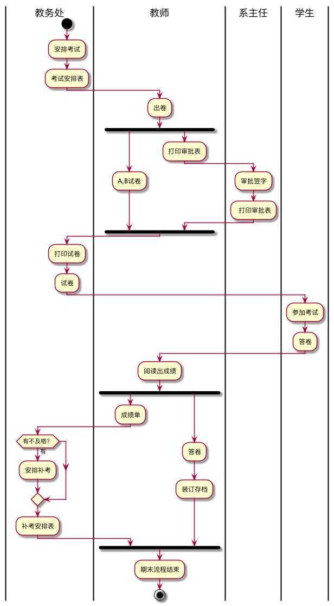
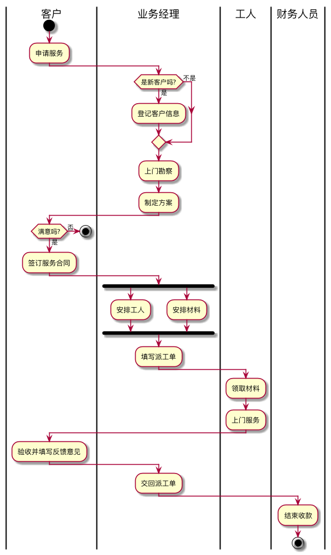

# 实验1：业务流程建模

|学号|班级|姓名|
|:-------:|:-------------: | :----------:|
|201510421131|软工(本)15-2|郑涛||

## 流程图1：考试及成绩管理流程
**PlantUML源码如下：**
```
@startuml
|教务处|
start
:安排考试;
:考试安排表;
|教师|
:出卷;
fork
   :A,B试卷;
fork again
   :打印审批表;
   |系主任|
   :审批签字;
   : 打印审批表;
end fork
|教务处|
:打印试卷;
:试卷;
|学生|
:参加考试;
:答卷;
|教师|
:阅读出成绩;
fork
   :成绩单;
   |教务处|
   if(有不及格？) then(有)
       :安排补考;
   endif
   :补考安排表;
fork again
   |教师|
   :答卷;
   :装订存档;
 end fork
 :期末流程结束;
stop
@enduml
```
**考试及成绩管理流程图如下：**


-
**考试及成绩管理流程说明：**
* 按照不同的使用者（用户类别）分成4行
1. 教务处安排考试并排出安排表
2. 教师出两套卷子并打印出审批表
3. 系主任审批试卷并打出审批表
4. 教务出打印出试卷
5. 学生参加考试提交答卷
6. 教师阅卷给出成绩单并将学生卷子存档
7. 教务处对不及格学生进行补考安排
8. 流程结束


## 流程图2：客户维修服务流程
**PlantUML源码如下：**
```
@startuml
|客户|
start
:申请服务;
|业务经理|
if (是新客户吗?) then (是)
  :登记客户信息;
else (不是)
endif
 :上门勘察;
:制定方案;
|客户|
if (满意吗?) then (是)
  :签订服务合同;
else (否)
  stop
 endif
 |业务经理|
fork
  :安排工人;
fork again
  :安排材料;
endfork
:填写派工单;
|工人|
:领取材料;
:上门服务;
|客户|
:验收并填写反馈意见;
|业务经理|
:交回派工单;
|财务人员|
:结束收款;
stop
@enduml
```

**客户维修服务流程图如下：**


-
**客户维修服务流程说明：**
* 按照不同的使用者（用户类别）分成4行
1. 客户填写申请服单
2. 业务经历判断是否为新客户，新客户需登记客户信息，上门勘察并制定方案。
3. 若用户满意之后签订服务合同，否则服务结束
4. 业务经理安排工人和材料好后填写派工单。
5. 工人领取材料进行上门服务。
6. 工人完成后用户进行验收并填写反馈意见。
7. 业务经理交回派工单。
8. 财务人员进行结算收款。
