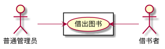

# 实验二--图书管理系统用例建模

|学号|班级|姓名|
|:-------:|:-------------: | :----------:|
|201510421131|软件(本)15-2|郑涛|

## 1.图书管理系统的用例关系图

**1.1 PlantUML源码如下：**

```
@startuml

left to right direction
skinparam packageStyle rectangle
actor 系统管理员 as root
actor 普通管理员 as admin
actor 借书者 as user


rectangle 图书管理系统{

    user --> (登录)

    user --> (查询历史借阅情况)
    user --> (预约图书)
    user --> (借阅图书)
    (借阅图书)<..(续借图书):<<include>>
    user --> (归还图书)
    user --> (查询图书信息)

    admin --> (登录)
    admin --> (图书馆信息公告发布)
    admin --> (查询图书信息)
    (借阅图书)<..(验证借阅者的信息):<<include>>
    admin --> (允许借阅图书)
    admin --> (图书维护)
    (验证借阅者信息)<..(归还图书):<<include>>
    (归还图书)<..(超期计算罚金):<<extend>>
    admin --> (允许归还图书)
    admin --> (取消预约)

    root --> (登录)
    root --> (借书者信息维护)
    root --> (普通管理员信息维护)
    root --> (图书维护)
    root --> (馆内图书查阅大数据统计)
    (增加图书)<..(图书维护):<<extends>>
    (删除图书)<..(图书维护):<<extends>>
    (修改图书)<..(图书维护):<<extends>>
    (查询图书)<..(图书维护):<<use>>
}

@enduml
```

**1.2 图书管理系统用例图如下**


## 2.用例规约表

**2.1 "借阅图书"用例**

|标题|内容|
|:----------: | :----------:|
|用例名|借阅图书|
|参与者|普通管理员（主要参与者）、借书者（次要参与者）|
|前置条件|图书管理员已经登录且验证了借书者信息|
|后置条件|更新系统中的图书与借书者信息|
|主事件流|1.借书者登录系统提交需要借阅的书籍;<br />2.普通管理员验证当前用户是否有借阅资格及书籍是否能被借阅;<br />3.将借书者的信息及图书信息在数据库当中更新;<br />4.重复2-4步骤，直至用户需要借阅书籍统计完毕;<br />5.告知借书者借阅结果。|
|备注|每本书都是必须在数据库中有记录|

**2.2 "归还图书"用例**

|标题|内容|
|:----------: | :----------:|
|用例名|归还图书|
|参与者|普通管理员（主要参与者）、借书者（次要参与者）|
|前置条件|图书管理员已经登录且验证了借书者信息且借书者有借阅书籍|
|后置条件|更新系统中的图书与借书者信息|
|主事件流|1.借书者登录系统提交需要归还的书籍;<br />2.普通管理员验证当前用户是否有借阅书籍及书籍是否超期;<br />3.若超期计算罚金，借书者支付后方能还书;<br />4.将借书者的信息及图书信息在数据库当中更新;<br />5.重复2-4步骤，直至用户需要归还书籍统计完毕;<br />5.告知借书者归还结果。|
|备注|每本书都是必须在数据库中有记录|

**2.3 "借阅图书"用例流程图源码如下：**

```
@startuml

actor 普通管理员 as admin
actor 借书者 as user

left to right direction
rectangle {

admin -->(借出图书)
(借出图书) <-- user

}

@enduml

```

**2.3.1 "借阅图书"流程图如下**



**2.4 "归还图书"流程图如下**

```
 @startuml
:图书管理员: as Admin
:借阅者: as User
left to right direction
rectangle {
Admin -->(归还图书)
(超期罚款).>(归还图书):<<extends>>
(归还图书) <--User
}
@enduml

```


## 3.参与者说明

**3.1 系统管理员**
主要职责是：
- 1.借书者信息维护
- 2.普通管理员信息维护
- 3.图书信息统计

**3.2 普通管理员**
主要职责是：
- 1.借书者操作信息处理
- 2.公告信息发布
- 3.接受用户罚金付款

**3.3 借书者**
主要职责是：
- 1.对图书的借阅、归还、查询
- 2.借阅对图书进行保管
- 3.按时归还图书，否则缴纳罚金
