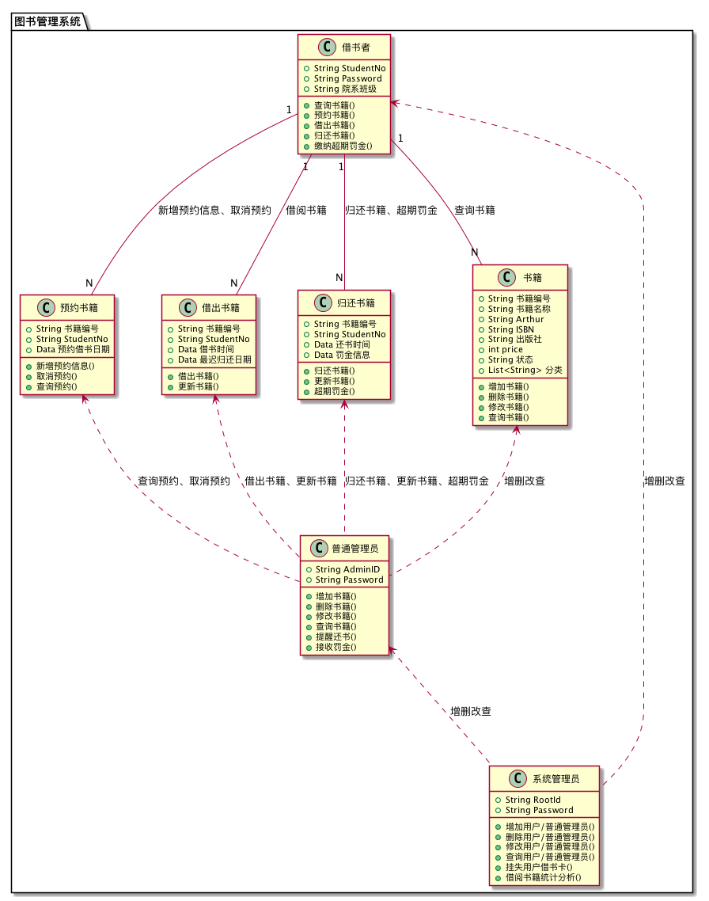

# 实验3：图书管理系统领域对象建模

|学号|班级|姓名|
|:---:|:---:|:----:|
|201510421131|15软件2班|郑涛|

## 1.图书管理系统类图

**1.1 PlantUML源码如下：**

```
@startuml

package "图书管理系统" {
class 预约书籍 {
  +String 书籍编号
  +String StudentNo
  +Data 预约借书日期

  +新增预约信息()
  +取消预约()
  +查询预约()
}
class 借出书籍 {
  +String 书籍编号
  +String StudentNo
  +Data 借书时间
  +Data 最迟归还日期
  +借出书籍()
  +更新书籍()
}
class 归还书籍 {
  +String 书籍编号
  +String StudentNo
  +Data 还书时间
  +Data 罚金信息
  +归还书籍()
  +更新书籍()
  +超期罚金()
}
class 书籍 {
   +String 书籍编号
   +String 书籍名称
   +String Arthur
   +String ISBN
   +String 出版社
   +int price
   +String 状态
   +List<String> 分类

   +增加书籍()
   +删除书籍()
   +修改书籍()
   +查询书籍()
}
class 借书者 {
   +String StudentNo
   +String Password
   +String 院系班级

   +查询书籍()
   +预约书籍()
   +借出书籍()
   +归还书籍()
   +缴纳超期罚金()
}
class 普通管理员{
     +String AdminID
     +String Password

     +增加书籍()
     +删除书籍()
     +修改书籍()
     +查询书籍()
     +提醒还书()
     +接收罚金()
 }
class 系统管理员 {
   +String RootId
   +String Password

   +增加用户/普通管理员()
   +删除用户/普通管理员()
   +修改用户/普通管理员()
   +查询用户/普通管理员()
   +挂失用户借书卡()
   +借阅书籍统计分析()
}

借书者"1" -- "N"书籍:查询书籍
借书者"1" -- "N"预约书籍:新增预约信息、取消预约
借书者"1" -- "N"借出书籍:借阅书籍
借书者"1" -- "N"归还书籍:归还书籍、超期罚金

书籍 <.. 普通管理员:增删改查
借出书籍 <.. 普通管理员:借出书籍、更新书籍
归还书籍 <.. 普通管理员:归还书籍、更新书籍、超期罚金
预约书籍 <.. 普通管理员:查询预约、取消预约
借书者 <.. 系统管理员:增删改查
普通管理员 <.. 系统管理员:增删改查

}

@enduml
```

**1.2 类图：**



## 2.图书管理系统对象图

### 2.1 类图书的对象图
#### 源码如下：
```
@startuml

object 图书{
     ISBN:978-7-302-32982-4
     书名:信息系统分析与设计
     作者:王晓敏
     总数:20
     预定数目:1
     已借出数目:3
     可借数目:16
}
@enduml
```
#### 对象图如下：


### 2.2 类借阅记录的对象图
#### 源码如下：
```
@startuml

object 借阅记录{
        日期:2018/4/15
        书籍价格:￥35
        书目:信息系统分析与设计
        读者账号:201817162636
}
@enduml
```
#### 对象图如下：


### 2.3 类读者的对象图
#### 源码如下：
```
@startuml

object 读者{
        账号：201817162636
        姓名：张三
        密码：******
        已借书目：3
        最大可借数目：20
}
@enduml
```
#### 对象图如下：


### 2.4 类预约的对象图
#### 源码如下：
```
@startuml

object 预约{
         预约日期：2018/4/10
         账号：201817162636
         数量：1
         ISBN：978-7-302-32982-4
}
@enduml
```
#### 对象图如下：


### 2.5 类图书管理员的对象图
#### 源码如下：
```
@startuml

object 图书管理员{
         职工号：19383473
         姓名：李四
         账号：1234
         密码：***
}

@enduml

```
#### 对象图如下：


### 2.6 类逾期记录的对象图
#### 源码如下：
```
@startuml

object 逾期记录{
        逾期天数：4
        读者账号：2019232792
}
@enduml
```
#### 对象图如下：


### 2.6 类罚款细则的对象图
#### 源码如下：
```
@startuml

object 罚款细则{
         每日罚款金额：￥0.5
}
@enduml
```
#### 对象图如下：

